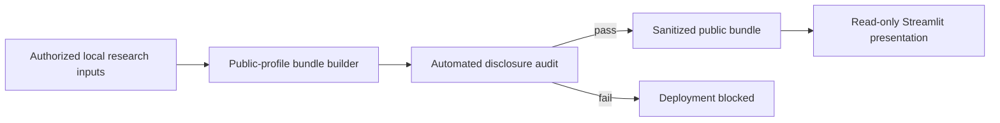

# PRECIPICE GNSS-IR Classification Review Studio

Teacher-facing Streamlit companion to Part I of the PRECIPICE GNSS-IR project
(Weeks 5–7). The application presents station context, the GNSS-IR observing
product, QC-derived proxy labels, and time-aware classification evidence in an
interactive format.

> **Project demo:** [Open the hosted Streamlit application](https://gnss-class.streamlit.app/)  
> The current deployment may require Streamlit sign-in, depending on its access
> settings.

## Purpose and research boundary

This application is a review and communication layer, not a production
monitoring system. It helps a reviewer examine:

- the field setting and GNSS-IR reflection geometry;
- daily observing-product and QC context;
- tide predictions as geographic and physical context;
- QC-derived proxy-label diagnostics; and
- model evidence from blocked and expanding-window validation.

The classification target is a **QC-derived proxy label**, not an independent
measurement of environmental truth. Pressure observations are available only
for two overlap windows, and tide predictions are contextual covariates rather
than pressure truth. The educational animations use either synthetic teaching
elements or explicitly identified, aggregated public tables.

## Data protection and disclosure controls

The deployed application is intentionally isolated from the laboratory data
tree. It reads one fixed, sanitized artifact:

```text
data/precipice_dashboard_public_bundle.pkl
```

It does **not** scan project folders, read `Data_Raw/` or `outputs/`, accept a
runtime bundle-path override, retrain a model, or regenerate notebooks. Private
source data are needed only when an authorized researcher builds the public
artifact locally; they are not needed by the deployed application.



### Public artifact contents

| Included in the public bundle | Explicitly excluded |
|---|---|
| Daily aggregated V5/QC values | Five-minute V5 source table |
| Six-hour tide and GNSS anomaly series | Level-1 arc rows and raw arc-feature schema |
| Reduced OOF prediction fields with probabilities rounded to three decimals | Raw pressure measurements |
| Aggregate model, fold, and feature-selection summaries | Static research figures and notebook outputs |
| Pressure **coverage intervals** without measurements | Absolute local paths and source-directory references |
| Coarsened display coordinates | Private bundle and runtime path overrides |

The repository uses two additional safeguards:

1. `.gitignore` blocks all dashboard pickle files by default and allowlists only
   `data/precipice_dashboard_public_bundle.pkl`.
2. `audit_public_bundle.py` fails if the public artifact exceeds its size limit,
   has an unexpected disclosure profile or schema, contains forbidden source
   paths, exposes raw-style tables, includes over-precise OOF probabilities, or
   embeds static research images.

The current local public artifact passed this audit on **2026-08-10**. Its
audited profile is:

- 0.28 MB;
- 433 daily V5 rows and 433 daily QC rows;
- 1,460 six-hour tide/GNSS rows;
- 2,880 reduced OOF rows; and
- 0 embedded images.

These controls prevent accidental publication of source-resolution laboratory
tables. They do not make information displayed by the app confidential: any
chart, aggregate result, coordinate, or time series visible in a hosted app is
public to everyone who has access to that deployment.

## Machine-learning leakage controls

The primary generalization evidence uses **expanding-window,
out-of-fold (OOF) validation**. Each fold trains on earlier months and evaluates
the next month while it is still unseen. The public fold summary covers 12
sequential validation months from November 2024 through October 2025.

The earlier Week 5 season-aware blocked holdout is retained as a feature
diagnostic only. Its scores are presented separately and are not ranked against
the expanding-window OOF results. The hosted app only visualizes precomputed
evidence, so user interaction cannot retrain, tune, or alter the model.

This design protects the reported temporal validation boundary. It does not
turn the QC-derived target into an independent physical label, so model scores
must be interpreted as reproduction of review logic rather than proof of sea
ice or water-level truth.

## Run the public application locally

Requirements: Python 3.11+ and [`uv`](https://docs.astral.sh/uv/).

```bash
uv sync
uv run python audit_public_bundle.py
uv run streamlit run streamlit_app.py
```

Open the URL printed by Streamlit, normally `http://localhost:8501`.

## Rebuild the sanitized bundle

Run this step only inside the authorized local project, where the approved
research inputs are available:

```bash
uv run python build_data_bundle.py --profile public
uv run python audit_public_bundle.py
```

The public-profile builder reads approved inputs from:

- `outputs/eda/week_5_classification_progress/`;
- `outputs/eda/week_6_progress/`;
- `outputs/eda/week_7_geography_visual_progress/`; and
- `Data_Raw/PRECIPICE/processed/spline_v5/precipice_sealevel_v5.csv`.

The builder aggregates, reduces, rounds, drops, or coarsens fields before
writing the deployable artifact. A build must not be released unless the audit
passes.

## Private local review

`data/precipice_dashboard_bundle.pkl` is a private artifact containing the
complete five-minute V5 series. It must never be committed or uploaded to
Streamlit Community Cloud. Authorized local reviewers can build and open it
deliberately with:

```bash
uv run python build_data_bundle.py --profile private
PRECIPICE_DASHBOARD_BUNDLE=data/precipice_dashboard_bundle.pkl \
  uv run streamlit run streamlit_app_legacy.py
```

The public `streamlit_app.py` cannot use this override; it is supported only by
the ignored legacy entry point.

## Release checklist

Before publishing a new application version:

1. Build with `--profile public`.
2. Run `audit_public_bundle.py` and require a passing result.
3. Confirm that no private bundle, raw file, secret, or local path is staged.
4. Review the public app as an unauthenticated or least-privileged viewer.
5. Reconfirm that every displayed result is approved for the deployment's
   audience.

`.gitignore` is not retroactive. If a private artifact was ever committed,
removing it from the current tree is insufficient: the Git index and repository
history must also be audited before widening access.

## Interpretation notes

- The geography map is a single-station look-sector review view, not a spatial
  interpolation of sea ice.
- Pressure data validate only two overlap windows.
- Tide predictions provide physical context; they are not pressure truth.
- Reconstructed Plotly views use audited, reduced tables rather than embedded
  static notebook figures.
- The “Signal detective” activity is educational and is not an independent
  environmental validation.
